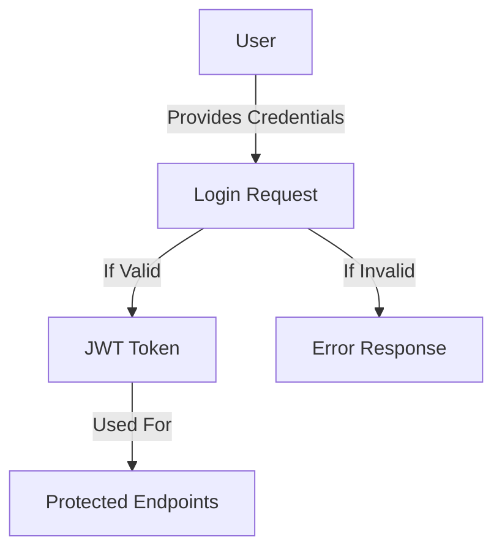

# School Health Management System API Workflows

This document describes the main workflows and processes in the School Health Management System API.

## User Management Workflows

### User Creation Flow

1. **Admin Users**

   - Created by existing super_admin users only
   - Required fields: username, password, email, role (super_admin or student_manager)
   - Admin accounts are always active by default

   ```mermaid
   graph LR
       A[Super Admin] -->|Creates| B[New Admin Account]
       B -->|Assigns Role| C[super_admin/student_manager]
   ```

2. **Students**

   - Created by admin users only
   - Required fields: first_name, last_name, class_name, gender
   - Optional: username, password (if student needs login access)

   ```mermaid
   graph LR
       A[Admin] -->|Creates| B[Student Account]
       B -->|Assigns to| C[Class]
   ```

3. **Medical Staff**

   - Created by admin users only
   - Required fields: username, password, first_name, last_name, email, phone_number, role
   - Role must be one of: Nurse, Doctor, Healthcare Assistant

   ```mermaid
   graph LR
       A[Admin] -->|Creates| B[Medical Staff Account]
       B -->|Assigns Role| C[Nurse/Doctor/Assistant]
   ```

4. **Parents**
   - Can self-register through public registration endpoint
   - Required fields: username, password, first_name, last_name, email, phone_number
   ```mermaid
   graph LR
       A[Parent] -->|Self Registers| B[Parent Account]
       B -->|Awaits| C[Student Link]
   ```

### Student-Parent Relationship Workflow

1. **Link Request Creation**

   ```mermaid
   graph TD
       A[Parent] -->|Initiates Link Request| B[Pending Request]
       B -->|Includes| C[Student ID]
       B -->|Includes| D[Relationship Info]
       D -->|Contains| E[Relationship Type]
       D -->|Contains| F[Emergency Contact Status]
   ```

2. **Link Request Processing**
   ```mermaid
   graph TD
       A[Admin] -->|Reviews Request| B[Pending Request]
       B -->|Can| C[Approve Request]
       B -->|Can| D[Reject Request]
       C -->|Creates| E[Student-Parent Link]
       C -->|Notifies| F[Parent]
       D -->|Notifies| F[Parent]
   ```

## Health Management Workflows

### Medical Event Management

1. **Creating Medical Events**

   ```mermaid
   graph TD
       A[Medical Staff] -->|Creates| B[Medical Event]
       B -->|Records| C[Event Details]
       C -->|Includes| D[Severity]
       C -->|Includes| E[Symptoms]
       C -->|Includes| F[Treatment]
       B -->|Notifies| G[Parent]
   ```

2. **Medical Event Follow-up**
   ```mermaid
   graph TD
       A[Medical Staff] -->|Updates| B[Medical Event]
       B -->|Can Change| C[Status]
       B -->|Can Add| D[Follow-up Notes]
       B -->|Can Schedule| E[Follow-up Check]
   ```

### Health Campaign Management

1. **Campaign Creation and Execution**
   ```mermaid
   graph TD
       A[Medical Staff] -->|Creates| B[Health Campaign]
       B -->|Defines| C[Campaign Details]
       C -->|Includes| D[Target Classes]
       C -->|Includes| E[Schedule]
       C -->|Requires| F[Parent Consent]
       F -->|If Approved| G[Execute Campaign]
   ```

## Access Control and Authentication

### Authentication Flow



### Authorization Levels

1. **Super Admin**

   - Full system access
   - Can create all user types
   - Can manage system settings

2. **Student Manager Admin**

   - Can create/manage students
   - Can manage student-parent relationships
   - Can create staff accounts

3. **Medical Staff**

   - Can create/manage medical events
   - Can create/manage health campaigns
   - Can view student health records

4. **Parents**

   - Can view their linked students' information
   - Can request student links
   - Can respond to campaign consents

5. **Students**
   - Can view their own health records
   - Limited system access

## Error Handling

All API endpoints follow a consistent error response format:

```json
{
  "success": false,
  "message": "Error description",
  "errors": [
    {
      "field": "affected_field",
      "message": "Specific error message"
    }
  ]
}
```

Common HTTP Status Codes:

- 200: Success
- 201: Created
- 400: Bad Request
- 401: Unauthorized
- 403: Forbidden
- 404: Not Found
- 500: Server Error

## Best Practices

1. **Authentication**

   - Always include the JWT token in the x-auth-token header
   - Tokens expire after 24 hours
   - Keep tokens secure and never share them

2. **Data Validation**

   - Always validate required fields
   - Use proper data types as specified in the API
   - Follow the specified formats for dates, emails, etc.

3. **Error Handling**
   - Always check response status codes
   - Handle errors gracefully in your application
   - Log errors for debugging purposes
